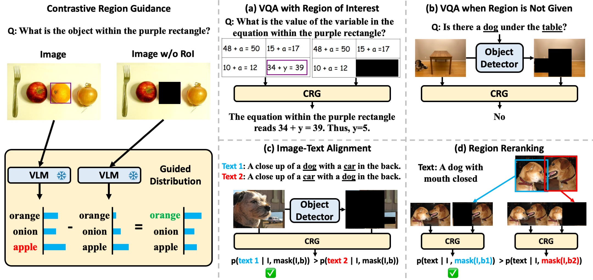

# Code for Contrastive Region Guidance: Improving Grounding in Vision-Language Models without Training

This repository contains the code for **CRG**, a training-free visual grounding method that guides any VLM to focus on specific regions in an image, as described in the paper:

**[Contrastive Region Guidance: Improving Grounding in Vision-Language Models without Training]()**

by  [David Wan](https://meetdavidwan.github.io/),
[Jaemin Cho](https://j-min.io),
[Elias Stengel-Eskin](https://esteng.github.io/),
[Mohit Bansal](https://www.cs.unc.edu/~mbansal/)

## Method




<br>

## Setup

1. Create environment

```bash
# Create python environment (optional)
conda create -n crg python=3.10 -y
conda activate crg
```

2. Clone and install LLaVA (We used 1.2.1.post4)

```bash
git clone https://github.com/haotian-liu/LLaVA.git
cd LLaVA
pip install -e .
cd ..
```

3. Install python dependencies

```bash
pip install -r requirements.txt
```

## Data
We provide a testing VQA example in `examples/questions.jsonl`.

The input of the file is a `jsonl` file consisting of:
- `question_id`: The unique id for the question.
- `image`: The image file name.
- `question`: The question string.
- `bboxs` (Optional): A list of bounding boxes in `(xyxy)` format. This triggers the code to automatically black out the image for the given regions for CRG if provided (and if `black-out-image-folder` is not supplied.) An example can be found in `examples/questions_with_bbox.jsonl`.

## Code
We provide, `crg/model_vqa_contrastive.py`, for running VQA is adapted from LLaVA's `model_vqa.py`. The relevant arguments are:
- `--model-path`: the model name of the LLaVA model, can be `llava-1.5-13b` or `llava-1.6-34b`, for example.
- `--conv-mode`: The conversation prompt the model expects, `llava_v1` or `chatml_direct`, for example.
- `--question-file`: The question file, for example `examples/questions.jsonl`
- `--answers-file`: The answer file, for example `./test_answer.jsonl`
- `--alpha`: The guidance strength parameter, set to 1 by default.
- `--image-folder`: The image path to the image files.
- `--black-out-image-folder`: The image path to the black out image files. We assume that the original and black out images have the same file name. This will trigger the model to run CRG.

Thus, there are two ways to trigger CRG:
1. Providing the `--black-out-image-folder` that points to the blacked out images saved locally.
2. Providing the bounding box regions in the question file with `bboxs`.
Otherwise, the model will just perform regular VQA using the model.

The actual CFG code is adapted from `transformer`'s `generate` function, which can be found in `contrastive_generate.py`. Note we only implement for greedy search. 

## Example
As an example, Running the original `LLaVA-1.6-34b`:
```
python model_vqa_contrastive.py --question-file examples/questions.jsonl  --image-folder examples/images --answers-file ./test.answer_orig
```

The output in `text` should be:

> The equation within the purple rectangle is:\n\n10 + a = 12\n\nTo find the value of the variable 'a', you need to solve for 'a'. You can do this by subtracting 10 from both sides of the equation:\n\na = 12 - 10\na = 2\n\nSo the value of 'a' in the equation within the purple rectangle is 2.


For CRG, we can run:
```
python model_vqa_contrastive.py --question-file examples/questions.jsonl  --image-folder examples/images --black-out-image-folder --images-folder examples/images_blackout --answers-file ./test.answer_blackout_from_images
```

Both should return:
> The equation within the purple rectangle reads: 34 + y = 39. To find the value of the variable `y`, you subtract 34 from both sides of the equation:\n\n34 + y = 39\ny = 39 - 34\ny = 5\n\nSo, the value of `y` in this equation is 5.


## Citation

If you find our project useful in your research, please cite the following paper:

```bibtex
@article{Wan2024CRG,
  author    = {David Wan and Jaemin Cho and Elias Stengel-Eskin and Mohit Bansal},
  title     = {Contrastive Region Guidance: Improving Grounding in Vision-Language Models without Training},
  year      = {2024},
}
```